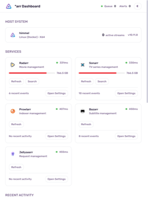
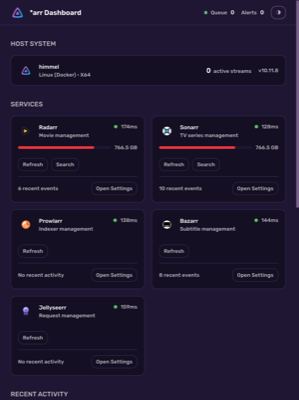
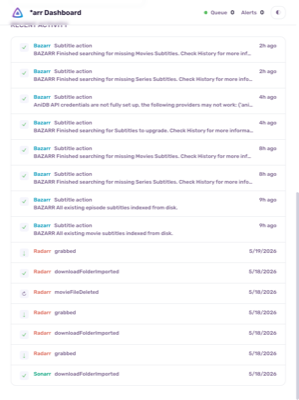
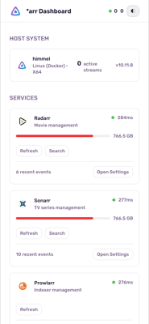
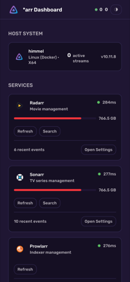

# *arr Ecosystem Dashboard

> A unified dashboard for managing your *arr ecosystem — Radarr, Sonarr, Prowlarr, Bazarr, and Jellyseerr — all in one place.

## Demo

### Desktop

<video src="https://raw.githubusercontent.com/noxaur/arr-dashboard/main/docs/media/demo-web.webm" controls width="640"></video>

### Mobile

<video src="https://raw.githubusercontent.com/noxaur/arr-dashboard/main/docs/media/demo-web-mobile.webm" controls width="320"></video>

## Screenshots

### Desktop

| | |
|---|---|
|  |  |
| *Dashboard overview (light mode)* | *Dashboard overview (dark mode)* |
|  | |
| *Recent activity feed* | |

### Mobile

| | |
|---|---|
|  |  |
| *Mobile dashboard (light mode)* | *Mobile dashboard (dark mode)* |

## Features

- **Unified Health View** — See the status of all services at a glance
- **Live Queue Data** — Active downloads, missing items, disk usage
- **Host System Info** — Jellyfin server details and active stream count
- **Recent Activity Feed** — Aggregated history from all services
- **Service Actions** — Pause downloads, refresh monitored, search missing
- **Light/Dark Mode** — System-aware with manual toggle
- **Client-Side Dashboard** — Skeleton loading, 30s polling, visibility-aware
- **Retry Logic** — Exponential backoff (2 retries), 15s timeout, error vs offline distinction
- **Shared Storage Detection** — Identifies services on the same disk, avoids duplicate metrics
- **Mobile Responsive** — Progressive disclosure of header metrics by breakpoint
- **SVG Service Logos** — Custom icons for each service

## Getting Started

### Prerequisites

- [Node.js](https://nodejs.org/) 20+
- [npm](https://www.npmjs.com/) or [Docker](https://www.docker.com/)

### Installation

```bash
# Clone the repository
git clone <repository-url>
cd arr-ecosystem-dashboard

# Install dependencies
npm install

# Copy environment file and configure
cp .env.local.example .env.local
```

Edit `.env.local` with your service URLs and API keys.

### Usage

```bash
# Start development server
npm run dev
```

Open [http://localhost:5487](http://localhost:5487)

### Docker Deployment

```bash
# Edit docker-compose.yml with your credentials
docker compose up -d --build
```

Open [http://localhost:5487](http://localhost:5487)

**Docker Configuration:**
- **Multi-stage build**: Builder stage installs deps and compiles, runner stage uses standalone output
- **Non-root user**: Runs as `nextjs` (uid 1001) for security
- **Node 20 Alpine**: Minimal base image (~50MB)
- **Standalone output**: Uses Next.js standalone mode for smaller production image
- **Restart policy**: `unless-stopped` — auto-restarts on failure or system reboot

**Updating:**
```bash
docker compose up -d --build
```

**Logs:**
```bash
docker logs -f arr-ecosystem-dashboard
docker logs --tail 100 arr-ecosystem-dashboard
```

## Project Structure

```
├── AGENTS.md                    # AI agent rules
├── CODEBASE.md                  # Codebase overview
├── DESIGN.md                    # Sentri design system spec
├── docker-compose.yml           # Docker compose configuration
├── Dockerfile                   # Multi-stage Docker build
├── package.json
├── tailwind.config.ts           # Tailwind with CSS variable colors, Rubik font
├── tsconfig.json                # TypeScript strict mode
├── vitest.config.ts             # Vitest test configuration
├── public/
│   └── favicon.svg              # App favicon
├── docs/
│   └── media/                   # Screenshots and demo media
└── src/
    ├── app/
    │   ├── globals.css            # CSS variables, component classes
    │   ├── layout.tsx             # Root layout with Rubik font
    │   ├── page.tsx               # Home page
    │   ├── dashboard-content.tsx  # Main client dashboard component
    │   ├── api/                   # API routes
    │   │   ├── actions/route.ts     # POST: pause/refresh/search
    │   │   ├── dashboard/route.ts   # GET: aggregated dashboard data
    │   │   ├── diskspace/route.ts   # GET: deduplicated disk space
    │   │   ├── health/route.ts      # GET: service health checks
    │   │   ├── jellyfin/route.ts    # GET: Jellyfin info + sessions
    │   │   ├── queues/route.ts      # GET: queue data
    │   │   └── system/route.ts      # GET: system status
    │   ├── radarr/page.tsx          # Redirect to Radarr
    │   ├── sonarr/page.tsx          # Redirect to Sonarr
    │   ├── prowlarr/page.tsx        # Redirect to Prowlarr
    │   ├── bazarr/page.tsx          # Redirect to Bazarr
    │   └── jellyseerr/page.tsx      # Redirect to Jellyseerr
    ├── components/
    │   ├── service-actions.tsx      # Pause/Refresh/Search buttons
    │   ├── service-icons.tsx        # SVG service icons
    │   └── theme-toggle.tsx         # Light/dark mode toggle
    └── lib/
        ├── api.ts                   # Core API helpers
        ├── api.test.ts              # API tests
        ├── auth.ts                  # Basic auth resolution
        ├── auth.test.ts             # Auth tests
        ├── jellyfin.ts              # Jellyfin API helpers
        ├── mock-data.ts             # Mock data for dev/testing
        └── services.ts              # Service configuration registry
```

## Available Scripts

| Command | Description |
|---------|-------------|
| `npm run dev` | Start development server on port 5487 |
| `npm run build` | Build for production |
| `npm run start` | Start production server |
| `npm run lint` | Run ESLint |
| `npm run test` | Run Vitest test suite |
| `npm run test:watch` | Run Vitest in watch mode |

## Configuration

### Environment Variables

| Variable | Description | Required |
|----------|-------------|----------|
| `RADARR_URL` | Radarr instance URL | Yes |
| `SONARR_URL` | Sonarr instance URL | Yes |
| `PROWLARR_URL` | Prowlarr instance URL | Yes |
| `BAZARR_URL` | Bazarr instance URL | Yes |
| `JELLYSEERR_URL` | Jellyseerr instance URL | Yes |
| `RADARR_API_KEY` | Radarr API key | Yes |
| `SONARR_API_KEY` | Sonarr API key | Yes |
| `PROWLARR_API_KEY` | Prowlarr API key | Yes |
| `BAZARR_API_KEY` | Bazarr API key | Yes |
| `JELLYSEERR_API_KEY` | Jellyseerr API key | Yes |
| `JELLYFIN_URL` | Jellyfin instance URL | No |
| `JELLYFIN_API_KEY` | Jellyfin API key | No |
| `ARR_BASIC_USER` | Global basic auth username | No |
| `ARR_BASIC_PASS` | Global basic auth password | No |
| `BASIC_USER_<SERVICE>` | Per-service basic auth username | No |
| `BASIC_PASS_<SERVICE>` | Per-service basic auth password | No |
| `USE_MOCK_DATA` | Use mock data instead of live API | No (default: `false`) |

### Services

| Service | ID | API Version | Color |
|---------|--------|-------------|-------|
| Radarr | radarr | `/api/v3` | Orange |
| Sonarr | sonarr | `/api/v3` | Teal |
| Prowlarr | prowlarr | `/api/v1` | Purple |
| Bazarr | bazarr | `/api` | Blue |
| Jellyseerr | jellyseerr | `/api/v1` | Pink |

## Architecture

```
┌─────────────────────────────────────────────┐
│              Dashboard (Next.js)             │
│  ┌───────────┐  ┌───────────┐  ┌──────────┐ │
│  │  Health   │  │   Queue   │  │ Activity │ │
│  │  Status   │  │   Data    │  │  Feed    │ │
│  └─────┬─────┘  └─────┬─────┘  └────┬─────┘ │
│        │              │              │        │
│  ┌─────▼──────────────▼──────────────▼─────┐ │
│  │      /api/dashboard (aggregated)        │ │
│  │  Single endpoint for all service data   │ │
│  └──────────────────┬──────────────────────┘ │
│                     │                         │
│  ┌──────────────────▼──────────────────────┐ │
│  │        Service Redirect Pages           │ │
│  │  Server components with redirect()      │ │
│  │  /radarr, /sonarr, /prowlarr, ...       │ │
│  └─────────────────────────────────────────┘ │
└─────────────────────┬────────────────────────┘
                      │
        ┌─────────────┼─────────────┐
        ▼             ▼             ▼
   ┌────────┐   ┌────────┐   ┌────────┐
   │ Radarr │   │ Sonarr │   │  ...   │
   └────────┘   └────────┘   └────────┘
```

**Data Flow:**
- `Promise.allSettled` ensures one service failure doesn't break the dashboard
- All external fetches use `arrFetch()` with 2 retries, exponential backoff, 15s timeout
- Client polls `/api/dashboard` every 30s when page is visible
- `USE_MOCK_DATA=true` returns mock data instead of live API calls

**API Routes:**

| Route | Method | Purpose |
|-------|--------|---------|
| `/api/dashboard` | GET | Aggregated data: all services + Jellyfin |
| `/api/health` | GET | Health check; `?service=radarr` for single |
| `/api/queues` | GET | Queue data; `?service=radarr` for single |
| `/api/actions` | POST | Execute actions: `{service, action}` |
| `/api/system` | GET | System status for all services |
| `/api/jellyfin` | GET | Jellyfin server info + active streams |
| `/api/diskspace` | GET | Deduplicated disk space |

## Tech Stack

- **Framework:** Next.js 15 (App Router)
- **Language:** TypeScript strict mode
- **Styling:** Tailwind CSS 3.4 + OKLCH color system with CSS variables
- **Font:** Rubik (Google Fonts, weights 400/500/600/700)
- **Testing:** Vitest 4.1.7 (node environment)
- **Linter:** ESLint 9 + eslint-config-next
- **Deployment:** Docker (multi-stage build, Node 20 Alpine, standalone output)

## Contributing

See [CONTRIBUTING.md](CONTRIBUTING.md) for guidelines.

## License

This project is licensed under the [LICENSE](LICENSE) License.
